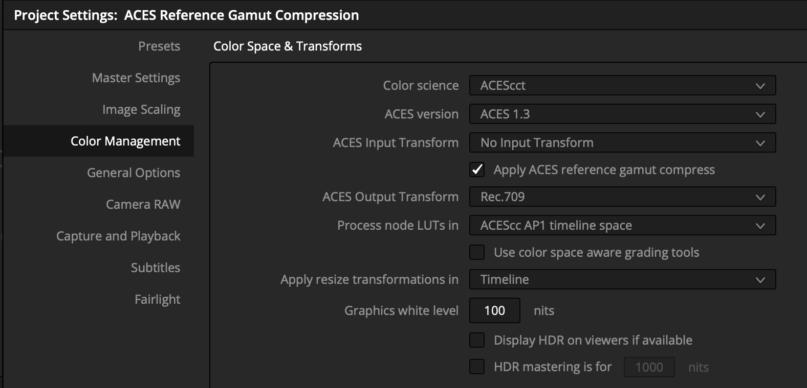
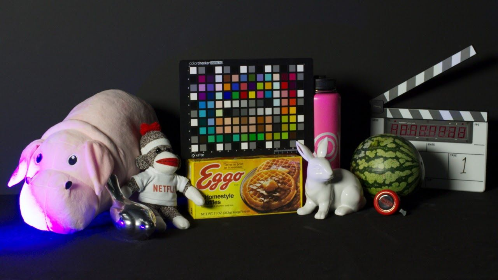
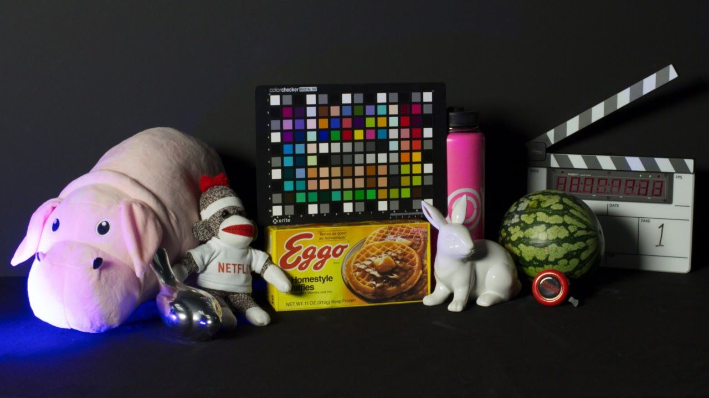
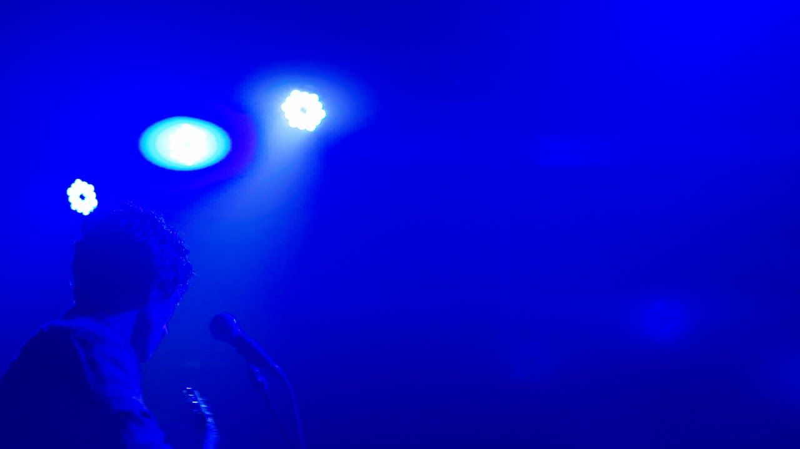
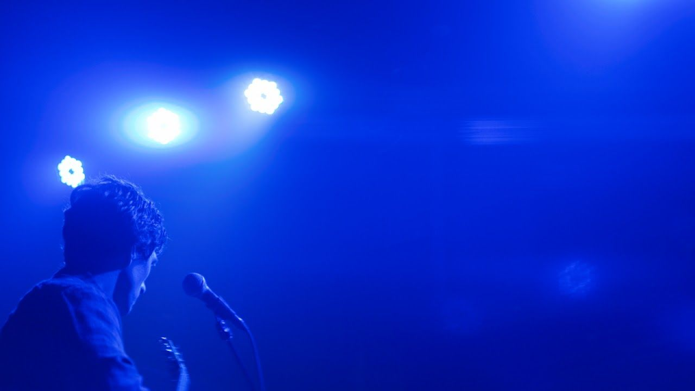
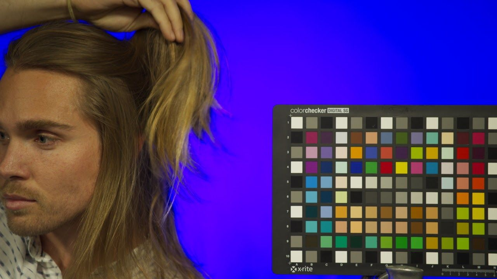
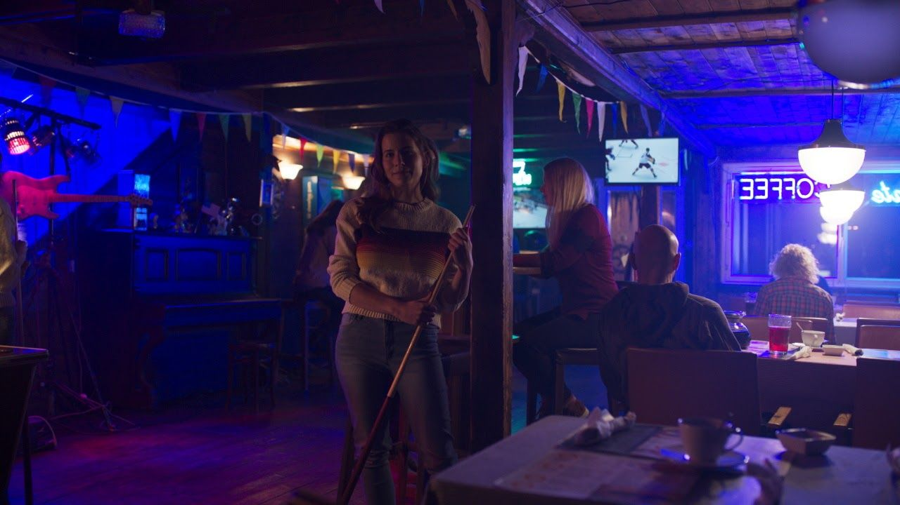
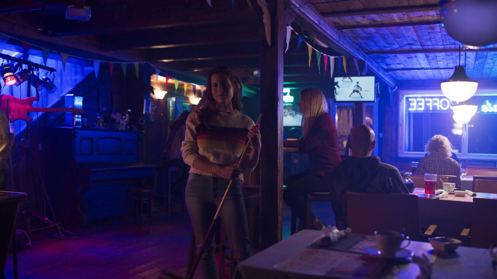
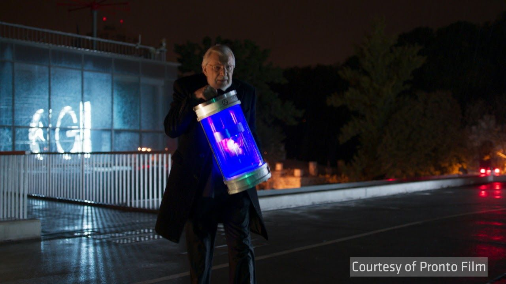
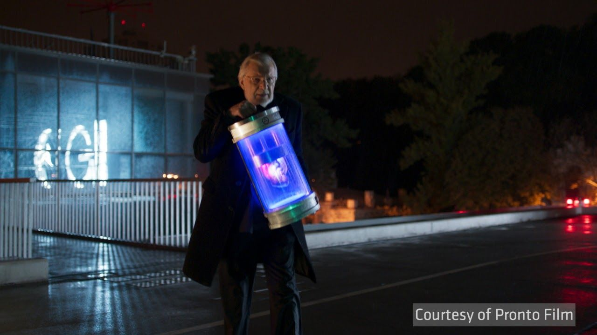

ACES Reference Gamut Compression User Guide
================

Scope 
----------------

The purpose of this document is to elaborate on suggested user workflows for on
set, dailies, visual effects, and finishing using the ACES Reference Gamut
Compression (RGC). For detailed technical specifications, please refer to the
ACES Gamut Mapping Architecture VWG - Technical Documentation.

References 
----------------

The following standards, specifications, articles, presentations, and texts are referenced in this text:

* [ACES Gamut Mapping Architecture VWG - Technical Documentation Deliverable](https://paper.dropbox.com/doc/tZHiuOCj0RdYw8PPkrTam)

Introduction
----------------

A common complaint from users of ACES has been the artifacts resulting from out
of gamut values in source images. These artifacts are most known for appearing
in highly saturated, bright LED light sources such as police car lights,
stoplights, etc - but also show up frequently in LED sources used to light
scenes. In an ACES workflow, these artifacts appear at two stages - first in the
conversion from camera raw RGB via an Input Transform (IDT) into ACES AP0 - and
second in the conversion from ACES AP0 into ACES AP1 (ACEScg and ACEScct). These
out of gamut pixel values are problematic when their negative components cause
issues in compositing, and may also produce visual artifacts when viewed through
an ACES Output Transform.

A Look Modification Transform (LMT) referred to as the [blue light artifact fix](https://github.com/ampas/aces-dev/blob/master/transforms/ctl/lmt/LMT.Academy.BlueLightArtifactFix.ctl)
was created as a temporary solution, but this solution affected all pixels in
the image, rather than just the problem areas. A new solution was needed which
preserved colors within a “zone of trust”, only altering the most saturated
values. The Reference Gamut Compression algorithm published in ACES 1.3 is
intended to replace and deprecate the Blue Light Artifact LMT.

Various options were investigated, and the working group finally settled on a
simple RGB ratio based algorithm which compresses values based on their distance
from the neutral axis. This makes no attempt to ascertain the “correct” value
for a pixel, since the nature of the problem means that these pixels may have no
correct color. The algorithm is intended as a technical correction rather than
an aesthetic look. It “heals” the problem pixels, to produce new RGB values
which are less problematic when used in subsequent compositing or grading
operations. Creative modifications are left for the user to apply as necessary
downstream of the RGC.

The ACES [Reference Gamut
Compression](https://github.com/ampas/aces-dev/blob/master/transforms/ctl/lmt/LMT.Academy.GamutCompress.ctl) 
uses fixed values [^1] for the thresholds where compression begins, and for the
amount of compression. These values have been calculated such that the colors of
the ColorChecker 24 will remain unchanged, and that any colors that are within
the encoding gamuts of all the commonly used digital cinema cameras (those with
official ACES IDTs) will be brought within AP1, thus ensuring positive ACEScg
values.  In most workflows, these constants will be invisible to the user, as
demonstrated in the screenshots from Resolve 17.4 below - the user has the
option to apply the RGC at a project or a clip level.

[^1]: Some implementations may also include a parametric version of the
    ACES gamut compression. If you choose to use this, it falls outside the scope
    of published ACES workflows, and therefore will need to be tracked manually.
    At that point it is simply another creative tool in the colorist’s arsenal.

<figure markdown>
  <figcaption>Reference Gamut Compression enabled via Project Settings in DaVinci Resolve 17.4</figcaption>
</figure>

<figure markdown>
  <figcaption>Reference Gamut Compression individual clip settings in DaVinci Resolve 17.4</figcaption>
</figure>

In the example below, artifacts such as the magenta solarization seen on the
nose of the Okja toy are greatly reduced by application of the RGC.

<figure markdown>
  <figcaption>Without the RGC</figcaption>
</figure>

<figure markdown>
  <figcaption>With the RGC applied</figcaption>
</figure>

Though the algorithm itself and application to an image is relatively simple,
there are many considerations to discuss for overall workflows for an ACES
project, from on set through to finishing.

General Workflow
----------------

As visualized in the flowchart above, it is recommended (in the current absence
of AMF for tracking) that most productions utilize the gamut compression in
every area - from on set all the way to finishing.  This means that at this
time, for simplicity, the the RGC is “always on” by default in any viewing
pipeline.  Following the general ACES workflow philosophy, the RGC is only baked
in to image data at the appropriate stage in the pipeline - which varies based
on the needs of your production, as outlined in the flow chart and explained
below.

### On Set
#### Live Grading
If your production is utilizing an on set grading software, such as Pomfort
Livegrade, use it to apply the Reference Gamut Compression. This will embed the
RGC in the 3D LUT which is passed to the LUT box for viewing on a monitor.
#### In-Camera
The production can create a 3D LUT of the appropriate size (normally 33x33x33
max) with the Reference Gamut Compression added to the existing viewing pipeline
to load into the camera.
### Dailies
Use a dailies generation software, such as Colorfront or Resolve, to import the
original camera footage, and apply the Reference Gamut Compression as a part of
your viewing pipeline for export to desired media.
### Editorial
Use media supplied from dailies, and back from VFX, to verify media as work
progresses. As editorial is largely offline and based on proxy media, the
RGC, as viewed on set, should be baked into the files sent to editorial.
### VFX
- Frame pulls for VFX should NOT have the Reference Gamut Compression baked in.
The files should be debayered to AP0.
- VFX will have the flexibility to apply the RGC wherever is best for their
compositing chain. This will often be the first node in the tree, but sometimes
operations such as a despill on a bluescreen will need to be performed pre-gamut
compression. Sending pulls to VFX in AP0 gives compositors the flexibility to
fine tune and control their work.
- Once applied, the Reference Gamut compression should NOT be inverted before
delivery.
- It is important that the RGC get applied to all WIP QT renders for review and
editorial, so as to match dailies.

### Finishing
- Finishing software should have the ability to apply the RGC at a project,
timeline, or clip level. This should give the colorist flexibility to choose
what works best for the project.
- The RGC should be applied directly after the IDT, ideally before any scaling,
grading, or other finishing work.
- In a pre-conformed timeline, apply the RGC as early as possible. 
- If frames are coming back from VFX, it will be important to track those vs.
non-VFX shots, so that the gamut compression is not applied twice.

Production Realities
----------------

### Order of Operations
The order in which the various operations are applied to an image has a
significant impact on the end result. In particular, any scaling will produce a
different result depending on whether it is done before or after the RGC, since
its removal of negative values can reduce some scaling artifacts. Some
applications may give the user detailed control over order of operations, but in
others the underlying processes are hidden. This is an important consideration
when planning workflows.

In compositing in particular, there may be operations (edge despill in keying
has been noted) where using the unmodified pixel values gives a preferable
result. In these cases it may be necessary for the compositor to have access to
both the original and gamut compressed image data in their node tree, choosing
between them as necessary. For consistency, the RGC should still be applied at
some other suitable point in the composite, such that the final renders
delivered to DI still have the gamut compression applied as expected.

Since normal practice in VFX is to return images with any pixel not touched by
the compositing process unmodified from the original pulls, one might think that
the RGC should be inverted for deliverables, as is done with CDL corrections,
for example. However, it is better to think of the RGC more like a spill
suppression, which is part of the composite, and would not be inverted out at
the end. Inverting creates the possibility that elements added during
compositing (CGI originally created in ACEScg, for example) which have not had
the RGC applied may produce extreme values on inversion. An inverse mode is
included in the algorithm, but is provided only for edge cases where it proves
unavoidable. Some education of the various stakeholders may be required to
establish why inverting is not preferable.

### Tracking
In the long term, the expectation is that application of the RGC will be tracked
using AMF (the ACES Metadata File). This will enable selective use of the
algorithm, rather than the currently recommended default of “always on”. Since
AMF is currently in development by the various software vendors, this will not
be practical until AMF is widely implemented. Unless AMF can be relied upon to
be correctly read and updated at every stage of the process, it will be of
little use – incorrect metadata is worse that no metadata.

The RGC is classed as an LMT (Look Modification Transform). But unlike most
LMTs, it is applied first, immediately after the IDT, rather than last, just
before the Output Transform. AMF can list multiple LMTs in its specification of
the viewing pipeline for a shot, so will include one for the RGC as well as
optionally one for a scene/show look. Compositing and grading work will be done
between these two LMTs.

LMT elements in an AMF include an `applied` attribute, so a shot which was
previously viewed (e.g. on set) with the RGC enabled will include an LMT for the
RGC, with the `applied` attribute set to `false`. If the shot is then passed
through VFX, and the RGC is then baked in, the `applied` attribute should be set
to `true` in the AMF returned with the shot to finishing. This will enable the
finishing system to automatically apply the RGC to original footage, but disable
it for shots from VFX.

In the short term, manual tracking will be needed. This is the reason for the
recommendation to have the RGC always enabled in the viewing pipeline (and
therefore baked into any media which includes the Output Transform). A slight
complexity is introduced by the requirement to apply the RGC before compositing
work, and therefore bake it into any VFX renders. This means it is necessary for
anybody working with a shot which has passed through VFX (including both
colorists and VFX artists adding a secondary compositing pass) to take account
of the fact that the RGC is already baked in, and not apply it a second time.
Until AMF automates this process, careful communication, and agreement upon
standard practices will be required. Please note that the workflows outlined in
this guide are recommendations, but the needs may vary by facility and
production.

### 3D LUT Implementation
While it is generally recommended to use full precision CPU/GPU implementations
of the ACES RGC transform some use cases may still require a 3D LUT based
implementation instead. Examples for this include (but are not limited to):

- On-set monitoring of live camera feeds
- Implementations using legacy versions of OpenColorIO (v2.0 or earlier)
- Other DCC applications that do not yet support ACES v1.3

The two main considerations for a 3D LUT implementation of the ACES RGC are the
LUT input color space and the transform precision.

#### LUT Input Color Space:
3D LUT input domains are usually in a 0.0 to 1.0 range (or equivalent integer
ranges). Since out-of-gamut color samples have component values below zero an
appropriate LUT input color space must be used in which all expected color
samples map into the 0.0 to 1.0 range.

For on-set monitoring, where the input gamut is known and fixed, such an input
color space could be the camera’s specific log-encoding (e.g.
LogC3/ARRIWideGamut, Log3G10/REDWideGamutRGB). These encodings are optimized for
the particular camera model and are expected to map all color samples into the
0.0→1.0 domain. Please note that ACEScct does not fulfill this requirement, even
if it is available as a camera RAW development target, and is therefore not
recommended to be used as an input encoding for a 3D LUT implementation of the
RGC. So for visual effects, review or mastering applications that have to
account for multiple input gamuts and are not able to rely on a specific camera
vendor encoding an analytic implementation is required.

#### LUT Precision:
To achieve a reasonable approximation of the ACES RGC transform a 3D LUT
implementation should use the highest practical resolution (e.g. 65x65x65) as
well as tetrahedral interpolation. However, even with high resolution LUTs, the
residual interpolation errors are significant enough to prevent accurate
inversion of the transform, especially at the gamut boundaries. Therefore 3D LUT
implementations of the RGC should be considered non-invertible.

Implementation Guide
----------------

If you are a software developer or engineer looking for technical implementation
guidelines for integrating the ACES Reference Gamut Compression in software,
please contact us.

Appendix
----------------

Before and after images, viewed through the Rec. 709 Output Transform

<!-- Include acronyms-->
--8<-- "mkdocs/includes/acronyms.md"

<!-- Include section numbering -->

